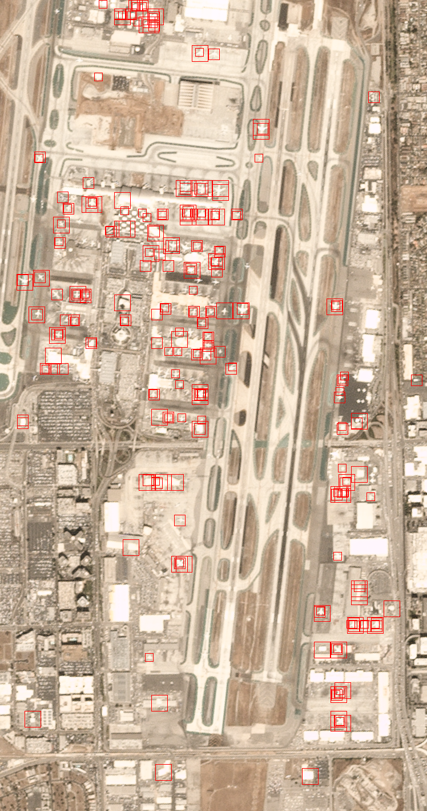

# Aircraft Detector, Machine Learning

This project develops an airplane detector using the [PlanesNet dataset](https://www.kaggle.com/datasets/rhammell/planesnet), which contains satellite images labeled as either "airplane" or "no airplane." The model's implementation and details are explained in the PDF located in the `/Aproxs` directory.

To detect multiple airplanes in larger images, a sliding window method is employed. This technique divides the image into smaller regions at different scales, sliding a window across the image in steps. For each window, the trained ANN predicts whether an airplane is present. If an airplane is detected, red borders are drawn around it in the output image. 

A sample execution is shown below, with more examples available in the `/Sliding_window/outputs` directory:

Please note that the development of this project was limited to the scope of an academic exercise. As such, the project has not undergone further refinement or optimization beyond this point.
